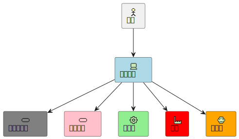
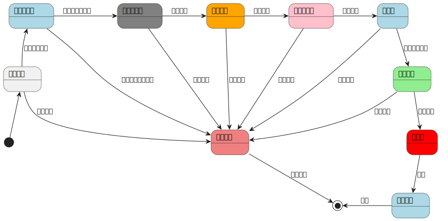
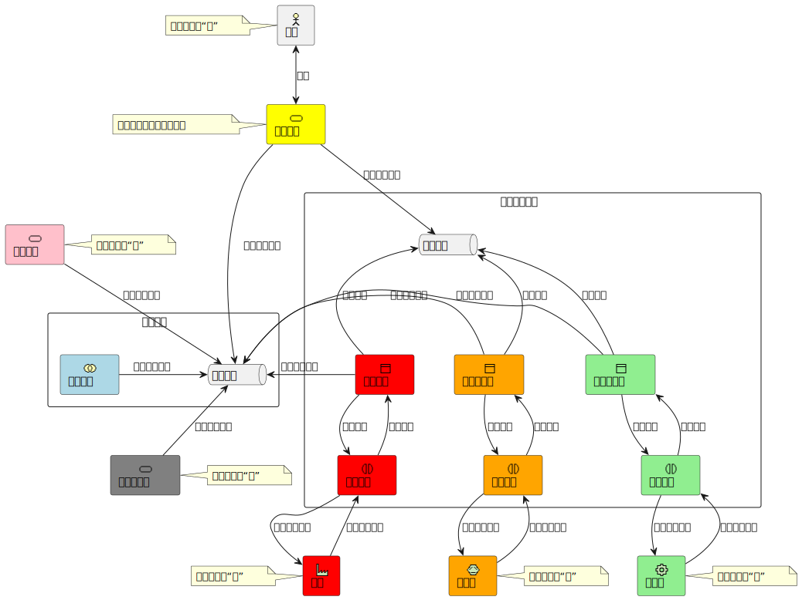

# 人机物融合的云收费架构

## 背景

车道收费软件（MTC）是高速公路收费系统的重要组成。传统MTC实现为桌面应用程序，运行在连接了各种车道可控制设备的工业计算机之上，并部署在车道收费亭内有收费站工作人员进行现场操作。其基本结构如下所示。

## 云收费架构

### 人机物融合
云计算平台技术的发展推动车道收费系统进行技术改造。一方面部分计算/数据密集型业务可以在云端部署运行，发挥云平台资源弹性可伸缩的优势；另一方面借助云计算模式构建面向高速业务的人机物融合应用架构。

传统车道软件实现多层面职责，包括：

1. 设备驱动控制
2. 收费业务过程
3. 用户交互界面

将这些职责进行分离，我们很容易得到以下调整过的架构。

车道业务逻辑在处于核心位置，用户（人）与设备和信息服务在车道业务逻辑协同下完成车道业务。以高速出口的收费业务为例，收费业务逻辑可用状态机建模：

该业务状态机执行过程中，在各参与方根据状态机状态变化而做出相应业务动作并产生业务事件，驱动状态机不断往前直至完成：

当然，作为物理设备的打印机、读卡器、栏杆等和用户并不能直接与车道业务这个信息服务进行交互，所以我们需要在计算机内为每个设备实现一个**设备封装服务**，作为其与信息服务交互的桥梁。这样的封装服务一方面提供与设备交互的软件接口，另一方面镜像了设备的当前（和历史）状态，所以这样的封装服务也可理解为设备的**数字孪生**。对于人来说，他/她与信息世界的交互入口就是我们在计算机上实现的桌面软件（UI），所以上面的架构可以再次细化为：

我们将这种架构称为人机物融合架构。

### 云计算架构

这一逻辑架构可采用以下云计算部署架构：

实际生产环境中，该系统需要服务多条车道，每条车道对应部署边缘节点，多条车道多辆车通行过程中，计费等计算密集型服务又可通过多实例水平扩展保证服务质量，形成以下运行部署。

其与传统桌面应用实现的业务架构相对比存在优势如下：

|桌面应用架构|人机物融合架构|
|---|---|
|业务逻辑固化在桌面应用中 | 业务逻辑独立运行管理，便于修改管理|
|设备直接被桌面应用访问，设备无法从外部进行管理|设备有其封装服务（或数字孪生）所代表，其状态可以自主上传，其接口可以独立访问|
|业务与设备、操作员和其他信息服务间是静态绑定关系，无法更改| 业务与设备、操作员和服务能动态绑定，运行时可实现各种灵活跨车道业务过程|

## 数字孪生

如前所述，我们需要为设备开发封装服务，或采用当前流行的数字孪生概念，将设备作为主体纳入信息空间参与业务逻辑所定义的协同过程。实际上我们开发UI系统给用户使用，也是让人在信息空间中被协同，可以看作是信息技术对人的能力/行为的封装。因此UI系统也可以认为是人（用户）的数字孪生，因为它定义了人在业务过程中的行为接口，并可以沉积人的状态并在信息世界中给出反映。

从以上分析我们可以看出，**人机物融合的核心是各类资源的数字化，通过将非信息资源的人和硬件经过服务封装或为其构建数字孪生，使人机物三者成为信息空间中独立且平等的一等实体（first class entity），使之可以在特定应用场景下与其他实体展开协同以实现该场景的业务目标。** 

数字孪生是人机物融合架构下的技术核心点。为设备与人等各类资源实现数字孪生，可在其中封装丰富的高层语义，甚至通过对实体状态数据采集积累，构建反映其本质内涵的数学模型，在信息空间形成自主的现实实体智能投射（projection）。在此基础之上，业务应用开发复杂度可得以降低，开发过程可敏捷化，所实现的业务过程可以更智能化。可以做个类比：让聪明人工作只需要定义宏观目标，他们自能发挥主观能动性和聪明才智既快又好地完成任务，这显然比指挥一群唯唯诺诺的简单事务执行者要完成复杂任务要省劲得多。

当前有若干数字孪生开源系统，例如[Eclipse Ditto](https://www.eclipse.org/ditto/)，实现数字孪生的基础功能：通过通信技术与设备进行交互，一方面对其进行遥测（telemetry）获取其状态，另一方面向其发送指令改变其状态。Ditto提供了[HTTP/MQTT/AMQP协议的通信适配器](https://www.eclipse.org/hono/docs/concepts/connecting-devices)实现，通信网关负责以设备本地协议与其交互，然后转换为Ditto标准适配器所要求的协议上传状态或下达指令。以收费车道栏杆为例：

实际上很多物联网平台也实现类似机制，例如[Thingsboard](https://thingsboard.io)，其[IoT Gateway子项目](https://thingsboard.io/docs/iot-gateway/)给出各类非TCP/IP协议连接设备的网关实现参考。

撇开这些具体系统给出的实现不谈，我们可以把数字孪生理解为某个实体对象的所有可观察属性和可交互接口的集合，或者更直白一点，每个数字孪生包含一组状态值，并可接收若干消息/指令。这些状态值由网关负责采集并汇聚到数字孪生管理系统中，这些消息/指令由网关从数字孪生系统向实体进行转发。

## 业务系统

业务系统实现现实中的一个需求。例如一辆车来到高速出口，我们需要有一个业务系统来完成对其进行收费的过程，正确收到过路费就是这个业务系统直接面对的用户需求。在进行业务场景调研的过程中我们就可以发现，这个系统会运行过程中设计到多个资源，通过有序地与获取资源状态（读取线圈状态以了解车辆位置）或与这些资源交互控制这些资源的状态（发出抬/落杆指令）来完成收费放行这样的业务过程，并最终满足"正确收费"这样的目标。

实现这样的业务系统当然需要开发某种形式的计算机程序来完成这样的有序获知和控制过程。选择一种程序设计语言当然是可以的，也可以采用某种更抽象的业务建模语言，例如业务流程定义语言（BPMN等）或者状态机定义语言（SCXML）等。这些语言可以用面向业务场景的元素简洁地定义业务过程，并在相应的解释器/执行器中进行执行。例如我们之前采用标准UML状态机模型定义每辆车经过收费站时的业务状态变化过程就是后者的一种实现，就建模方法而言，我们可以把整个过程中需要某个资源参与（被使用）的每个阶段定义为一个状态，把资源参与的结果作为从一个状态至另一个状态变迁的事件，如此形成的状态机模型就刻画了收费业务过程执行中资源的协同逻辑。

此处我们选取用状态机进行业务建模，下图展示了在此业务模型下。

>此图只为示意，其中部分细节并不完全合理，例如在“车辆可通行”状态下我们同时启动读卡界面并启动读卡服务，实际上读卡过程中用户界面起到监视读卡过程的作用。更合理的设计方法应该是单独设计一个用户界面，连接到数字孪生系统下直接读取读卡器对应数字孪生体状态。打印、抬杆、黑名单查询、计费等过程皆同。

当状态机开始解释执行时，在不同业务状态下相应的服务被驱动起来，或者相应的用户界面被显示出来。这一驱动过程可以采用传统RPC调用的同步通信方式，或采用事件驱动的异步通信方式。因为状态机的状态变化一般理解为一个事件的发生，所以此例中我们偏向于后者（如果采用流程定义语言建模业务，则偏向于前者，因为流程节点一般理解为启动一个任务的执行）。故此，系统架构可细化为如图所示。

To be continued ...

