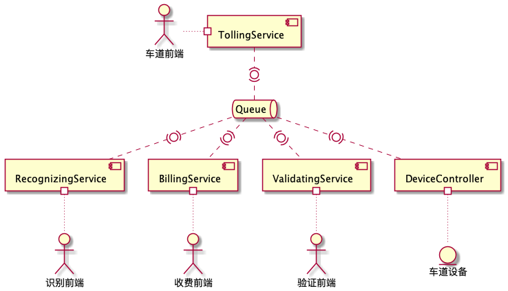
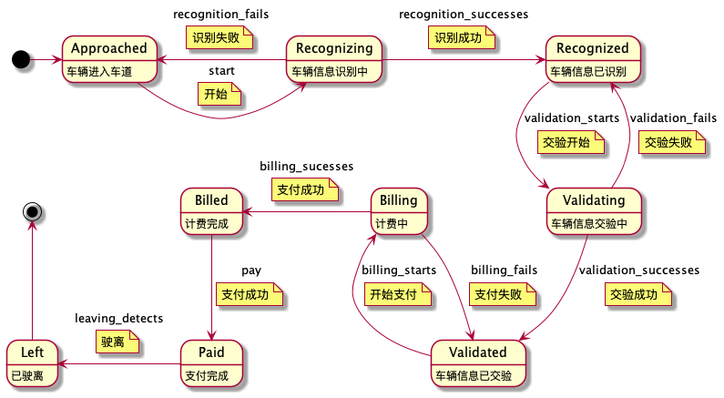

# Tollgate

本项目为事件驱动的微服务系统设计演示之用。系统包括若干独立服务（SpringBoot应用）相互协同完成车辆的收费放行业务。

### 架构

本项目所实现系统以`TollingService`为中心，该服务负责对每辆进入收费站区域的车辆收费业务进行状态管理，
将一辆车进入车道后的收费业务状态以消息形式通过消息中间件（RabbitMQ）发送给其他服务，其他服务订阅其需要的消息进行相应处理，
处理结果再以消息形式发送给`TollingService`驱动业务状态发生变化，到达新状态时`TollingService`再次发送消息通知其他服务，以此往复。

系统架构如图所示。

### 业务模型

本例中针对车辆出站（MTC车道）的收费业务建模如图所示。

我们采用 [SCXML](https://www.w3.org/TR/scxml/) 对车辆进行状态建模，并使用 [Apache Common SCXML](https://commons.apache.org/proper/commons-scxml/) 作为该模型的运行引擎。

### 业务场景

当前版本（ [build-220221](https://github.com/caochun/tollgate/releases/tag/build-220221) )中实现`TollingService`和`RecoginzingService`，用户可通过这两个服务实现车辆进站注册并识别车辆信息的场景。如下图所示：

其中`TollingService` 实现以下web接口与用户交互：
- `GET http://localhost:8080/register` ，调用该接口则在`TollingService`创建一个新的业务状态机（初始化为`approached`状态，业务相应的车辆车牌初始化为`中-PLATE`)；
- `GET http://localhost:8080/tollings` ，返回`TollingService`中目前管理的业务状态机列表；
- `GET http://localhost:8080/start?id={vehicleId}` ，传入一个业务的id，向其状态机发送`start` 消息。

`RecognizingService` 实现以下web接口与用户交互：
- `GET http://localhost:8090/unconfirmed` , 返回`RecognizingService` 中当前等待确认车辆信息的业务列表；
- `GET http://localhost:8090/confirm?id={vehicleId}` ，传入一个业务的id，确认所识别的该业务对应车辆信息；
- `GET http://localhost:8090/unconfirm?id={vehicleId}` ，传入一个业务的id，否认其识别的该业务对应车辆信息。

每个服务都从消息队列订阅消息，或通过消息队列发出消息。当前`TollingService`在每个状态机对象进入某个状态（state）时通过消息队列发送包含业务数据（`Tolling`对象）及其当前状态的消息（`TollContext`)，
`RecognizingService`订阅这些消息，并在收到时执行`TollgateServcie` 对象的`accept()` 方法；`RecognizingService`执行过程中可能发出包含车辆信息和业务状态转移（transition）的消息，
这些消息被`TollingService`所订阅并驱动其`accept()` 方法执行处理。

上图所示的业务场景对应的执行过程如下：

1. 车辆进入收费站（车道），车道前端的操作员或某种自动识别服务可调用`TollingService`的`register`接口在`TollingService`中为该车辆创建一个`TollingStateMachine`对象
2. 车道前端的操作员可通过`TollingService`的`tollings`接口查看当前所管理车辆；
3. 车道前端的操作员可通过`TollingService`的`start`接口向某业务的状态机对象转发`start`消息；
4. 业务状态机收到`start`消息后进入`recognizing`状态等待识别，进入该状态时`TollingService`发出状态消息；
5. 该状态消息由`RecognizingService`接收，触发识别逻辑（当前自动生成一个随机车牌号模拟识别过程），并将识别结果保存在其内部；
6. 识别前端的操作员（与前述操作员可以是同一个人或不同的人）可通过向`RecognizingService`的`unconfirmed` 接口发送请求查看识别结果；
7. 识别前端的操作员可通过`RecognizingService`的`confirm`接口确认识别结果正确或`unconfirm`接口确认识别错误，相应地发送`recognition_successes`或`recognition_fails`消息；
8. `recognition_successes`或`recognition_fails`消息由`TollingService`收到消息后驱动车辆状态发生变化，继而发送下一个状态消息，以此往复。

### 架构优势

每辆车进出收费站的车道业务被建模为一个状态机，在不同状态下操作人员或服务可对车辆进行不同操作管理过程，推动状态机发生状态迁移，继而达到下一业务阶段，这一设计可带来的优势主要包括：

1. 单个状态下要实现的业务服务相互独立，并仅通过消息生产与消费进行协作，实现服务间松耦合，便于进行开发任务切分；
2. 业务过程通过状态机模型，业务调整时仅需调整模型而无需改写过多代码（甚至无需改写任何代码），方便实现业务需求变更和系统演化；
3. 所有车辆的业务状态全局可见，每个服务可由不同用户进行访问操作，可支持多人协作完成任何一辆车的出站/进站交易；
4. 每个服务可单独部署运行，单个服务可运行多个实例，在消息中间件相应机制（consumer group）支持下，可实现多实例负载均衡，系统水平扩展性强；
5. 在服务多实例的基础上，MQ与数据库等底层设施也可采用分布式或集群化部署，整个系统可消除单点实效问题；
6. 在此系统边界可设计建立REST风格的标准化资源API接口，形成云收费车站的技术标准，支持与第三方对接；
7. 及其他。

### 消息驱动

服务间通信采用RabbitMQ作为通信中间件。RabbitMQ符合AMQP规范，实现pub/sub模式，如下图所示。

项目采用[Spring Cloud Stream](https://docs.spring.io/spring-cloud-stream/docs/current/reference/html/) 实现应用与MQ的自动连接配置，在该框架的支持下，在消息发送和接收的服务中只需要定义`java.util.function.Supplier`（或`org.springframework.cloud.stream.function.StreamBridge`）和`java.util.function.Consumer`对象通过定义binding即可连接到MQ中的destination（即 exchange）生产和消费消息。如下图所示。

